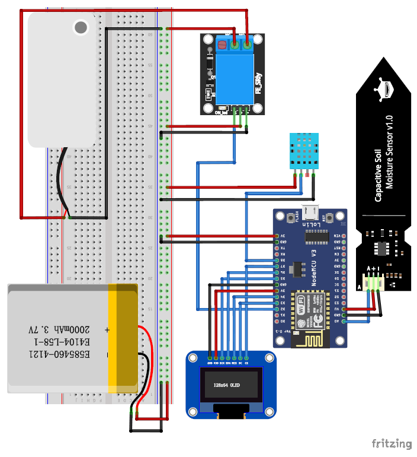
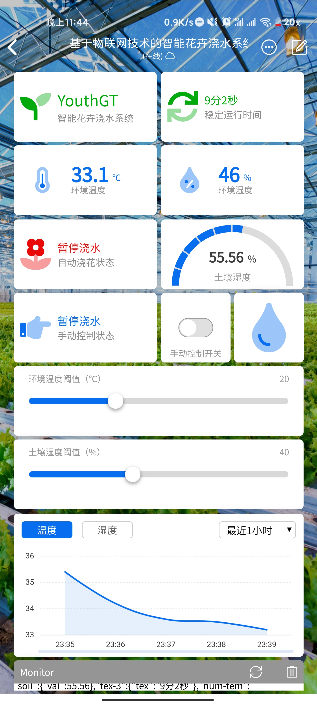

# Auto Watering System

## 基于物联网技术的自动浇水系统

一个开源的基于blinker物联网平台的一个浇水系统；

能够实现自动浇水，土壤水分检测，实时室内温湿度检测，实时同步数据到手机端，手机端可以控制手动进行浇水

## 装配清单

所需要的所有东西

* 7Pin0.96 SPI OLED      *  1显示屏
* NodeMcu esp8266     *  1
* USB-A to micro-USB  *  1 
* 杜邦线                         若干
* 一位继电器                  *  1
* 面包板                         *  1

## 软件

所有的代码都在 AUTO_WATERING.ino 文件中，使用arduino打开 编译下载即可

值得注意的是 ，必须先安装esp8266扩展（Blinker官方建议安装2.5.0版本），下载blinker库，下载u8g2库,还有DHT11库，才能够正常编译

库文件的下载方式请自行搜索，

具体接入方法请查看blinke官方教程
 [使用esp8266](https://doc.blinker.app/?file=001-%E5%BF%AB%E9%80%9F%E5%BC%80%E5%A7%8B/02-esp8266%26WiFi%E6%8E%A5%E5%85%A5)

有任何blinker接口函数上的问题请查看

[blinker开发文档](https://doc.blinker.app)

接入流程 

开机 

**在Blinker APP 中 开发者>开发工具>EspTouch** 进行配网（也可直接在程序中设置）
输入自己的WIFI名称 密码 手机会自动将密码发送到设备上

在blinkerAPP中需要进行导入配置

导入后界面如图所示

## 硬件电路

OLED
      VCC    >    3V或5V

      GND   >    GND

​      D5      >     MOSI

​      D6     >     SCK

​      D3      >     DC

​      D7      >     CS 

​      D4      >     RES

继电器

​      VCC    >    3V或5V

​      GND   >    GND

​      SIG     >     D2

土壤湿度传感器

​      VCC      >     5V或3V

​      GND     >     GND

​      SIG        >     A0     //必须为A0，该数据为模拟量，ESP8266只有一个模拟输入口

DHT 11温湿度传感器

​      VCC    >    3V或5V

​      GND   >    GND

​      SIG     >     D8